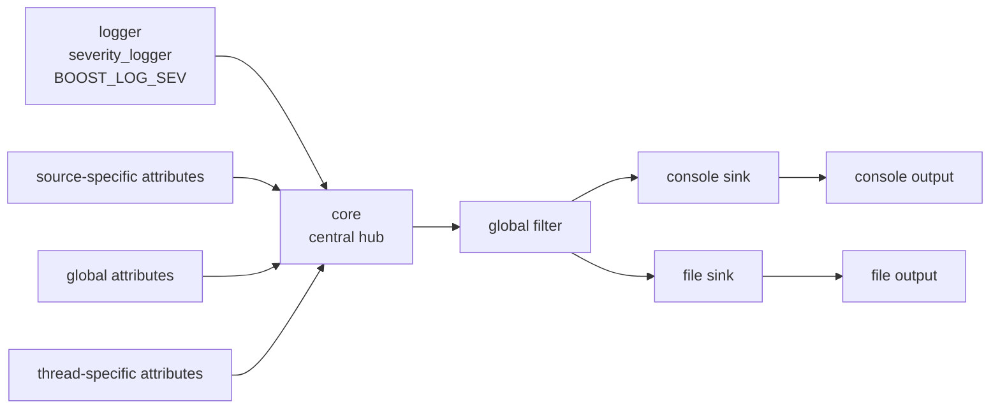

# Concept 01. Core, Sinks, Attributes, And Helpers

## 왜 이 문서가 필요한가

지금 프로젝트를 보면 `add_console_log`, `add_file_log`, `add_common_attributes` 같은 함수를 붙여서 기능을 조합하는 느낌이 강하다.  
하지만 `Boost.Log`는 단순한 기능 묶음이 아니라, **로그 레코드를 수집하고 가공하고 전달하는 구조**를 가진 라이브러리다.

이 문서는 그 구조를 먼저 이해하기 위해 만든다.

## 가장 먼저 잡아야 할 그림

공식 문서의 Design overview 기준으로 `Boost.Log`는 크게 세 층으로 볼 수 있다.

1. 로그를 만드는 쪽
2. 로그를 처리하는 쪽
3. 둘 사이를 연결하는 중앙 허브

현재 프로젝트에 대응시키면 아래처럼 이해하면 된다.

- `severity_logger` 같은 logger: 로그를 만드는 쪽
- `core`: 중앙 허브
- console/file sink: 로그를 처리하는 쪽

즉, 현재 예제는 사실 다음 흐름을 축약해서 보여주고 있다.

```text
logger -> core -> sink -> console/file
```

## 그림으로 보면

### 단순 그림

```text
+-------------------+        +-------------------+        +-------------------+
| logger            |        | core              |        | sinks             |
|                   |        |                   |        |                   |
| severity_logger   | -----> | central hub       | -----> | console sink      |
| BOOST_LOG_SEV     |        | filter            |        | file sink         |
| open/push record  |        | global attributes |        | formatter/output  |
+-------------------+        +-------------------+        +-------------------+
```

### record 흐름 그림

```text
1. logger가 record 생성
   |
   v
2. source/global/thread attribute 결합
   |
   v
3. core가 record 수신
   |
   +--> global filter 적용
   |
   v
4. sink 목록으로 fan-out
   |
   +--> console sink -> formatter -> console
   |
   +--> file sink    -> formatter -> file
```

### helper까지 포함한 그림

```text
add_common_attributes()
    -> core->add_global_attribute(...)

add_console_log()
    -> console sink 생성
    -> core->add_sink(...)

add_file_log()
    -> file sink 생성
    -> 옵션 설정
    -> core->add_sink(...)
```

### Mermaid 그림



## core는 정확히 무엇인가

공식 문서에서 `core`는 **log sources와 sinks를 연결하는 central hub**로 설명된다.

현재 프로젝트 관점에서 `core`는 아래 역할을 가진다.

- 글로벌 attribute 저장소를 가진다
- thread-specific attribute 저장소를 가진다
- global filter를 적용한다
- 등록된 sink 목록을 관리한다
- log source가 만든 record를 sink들로 전달한다
- 필요하면 flush를 수행한다
- 예외 처리 hook를 가진다

중요한 점은 `core`가 단순한 설정 객체가 아니라는 것이다.  
`core`는 실제로 **로그 흐름이 지나가는 중앙 통로**다.

### core를 더 실무적으로 이해하면

`logger`가 메시지를 그냥 파일에 바로 쓰는 것이 아니다.

대략 이런 순서다.

1. logger가 log record를 연다
2. 그 시점에 attribute 값들이 record에 붙는다
3. record가 `core`로 전달된다
4. `core`가 global filter를 적용한다
5. 통과한 record를 각 sink에 전달한다
6. 각 sink가 자기 filter/formatter/backend 규칙으로 처리한다

그래서 `core`를 이해하지 못하면 `sink`, `attribute`, `filter`가 왜 따로 존재하는지도 잘 안 보인다.

## core에서 자주 보게 되는 공용 함수

공식 `core` 문서를 보면 `core`는 단순히 sink만 붙이는 객체가 아니다.  
로그 활성화, filter, sink 등록, attribute 등록, flush 같은 공용 함수를 제공한다.

학습 초반에는 아래 함수들만 정확히 이해해도 충분하다.

### core::get()

- application-wide singleton인 `core` 인스턴스를 가져온다
- 대부분의 전역 로깅 설정은 여기서 시작한다

현재 프로젝트의 `ResetLogging()`도 이 함수로 `core`를 얻는다.

### add_sink(...)

- 새 sink를 `core`에 등록한다
- 등록된 뒤부터 그 sink는 log record를 받는다
- 같은 sink를 중복 등록할 수는 없다

helper 관점에서 보면 `add_console_log()`와 `add_file_log()`는  
내부적으로 sink를 만든 뒤 결국 `core`에 붙이는 축약 버전이다.

### remove_sink(...)

- 특정 sink 하나만 출력 파이프라인에서 제거한다
- 그 sink는 이후 record를 받지 않는다

이 함수는 sink 객체를 직접 들고 있을 때 유용하다.

예를 들어:

- 콘솔 sink만 잠시 끄고 싶을 때
- 파일 sink만 교체하고 싶을 때

### remove_all_sinks()

- 현재 `core`에 등록된 모든 sink를 한 번에 제거한다
- 이후 새 sink를 다시 등록하기 전까지는 출력 대상이 없어진다

이 함수는 "로깅 설정을 초기화하고 다시 구성"할 때 유용하다.

현재 프로젝트의 [`BoostLogShared.cpp`](../phases/BoostLogShared.cpp)에서  
`ResetLogging()`이 바로 `remove_all_sinks()`를 호출한다.

왜 이게 필요하냐면, 지금 프로그램은 같은 프로세스 안에서 `Phase 01`, `Phase 02`, `Phase 03`을 반복 실행한다.  
이때 이전 phase가 등록한 sink를 지우지 않으면 다음 phase에서 sink가 누적된다.

예를 들면:

- `Phase 01`이 console sink를 등록
- 이어서 `Phase 03`이 console sink와 file sink를 또 등록
- 정리 없이 진행하면 console 출력이 중복되거나, 의도하지 않은 sink 조합이 남을 수 있다

즉, 이 프로젝트에서 `remove_all_sinks()`는 sink 구성을 정리해 다음 phase를 다시 실험하게 돕는다.  
다만 global attribute 값까지 완전히 초기화하는 것은 아니므로, `LineID` 같은 값은 phase 사이에서 이어질 수 있다.

### set_filter(...) / reset_filter()

- `set_filter(...)`는 global filter를 건다
- `reset_filter()`는 그 global filter를 제거한다

이 필터는 모든 record에 먼저 적용된다.  
그 뒤에 각 sink가 자기 sink 전용 filter를 추가로 적용할 수 있다.

학습용으로는 이렇게 이해하면 된다.

- global filter: `core` 입구에서 1차로 거르는 필터
- sink filter: 각 sink 앞에서 2차로 거르는 필터

### add_global_attribute(...)

- global scope attribute를 등록한다
- 이후 모든 logger와 thread에서 이 attribute를 사용할 수 있다

`add_common_attributes()`는 바로 이 함수를 여러 번 호출하는 helper로 이해하면 된다.

### add_thread_attribute(...)

- 현재 thread에만 적용되는 attribute를 등록한다
- 멀티스레드 로깅에서 thread-local한 맥락 정보를 붙일 때 유용하다

현재 프로젝트에서는 직접 쓰지 않지만, 문서에서 말하는 thread-specific attribute의 실제 등록 지점이 여기에 해당한다.

### flush()

- 등록된 sink들의 내부 버퍼를 비우도록 요청한다
- 비동기 처리나 버퍼링이 있을 때 동기화된 상태를 맞추는 데 쓴다

현재 예제는 `auto_flush = true`를 주고 있어서 file sink가 매 레코드마다 flush에 가까운 동작을 한다.  
하지만 더 일반적인 설정에서는 `flush()`의 의미가 더 커진다.

### open_record(...) / push_record(...)

- 이 함수들은 `logger`가 내부적으로 `core`와 상호작용할 때 쓰는 저수준 진입점이다
- 학습 초반에는 직접 호출하지 않아도 된다

중요한 것은 `BOOST_LOG_SEV(...)` 같은 매크로 뒤에서 결국  
"record를 열고 -> 값을 채우고 -> core로 밀어 넣는" 흐름이 있다는 점이다.

## sink는 무엇인가

공식 문서에서 sink는 **logging record를 consume하는 출력 처리 단위**다.

학습용으로는 이렇게 이해하면 가장 쉽다.

- logger는 "기록할 이벤트를 만든다"
- sink는 "그 이벤트를 어디에 어떻게 내보낼지 결정한다"

현재 프로젝트의 sink는 두 종류다.

- console sink
- file sink

### sink가 하는 일

sink는 단순히 출력 대상만 의미하지 않는다.  
보통 아래를 함께 가진다.

- 출력 대상
- sink 전용 filter
- sink 전용 formatter
- flush 정책

즉, sink는 "stdout에 쓰는 함수"가 아니라 **출력 파이프라인 하나**에 가깝다.

### 왜 sink가 여러 개일 수 있나

공식 utility 문서에서 `add_console_log`와 `add_file_log`는 서로 충돌하지 않고 함께 쓸 수 있다고 설명한다.

그 이유는 record 하나를 여러 sink에 전달할 수 있기 때문이다.

예를 들면:

- 콘솔에는 전체 로그 출력
- 파일에는 Warning 이상만 저장
- 다른 파일에는 포맷을 바꿔 저장

현재 `Phase 03`은 바로 이 구조를 가장 단순하게 보여준다.

## attribute는 무엇인가

공식 문서에서 attribute는 **log record에 연결되는 메타 정보**다.  
중요한 점은 attribute와 attribute value를 구분하는 것이다.

- attribute: 값을 만들어내는 쪽
- attribute value: 특정 record에 실제로 붙은 값

예를 들면:

- `local_clock()`는 attribute다
- `2026-Apr-20 12:34:56`은 attribute value다

즉, attribute는 값 자체가 아니라 **값 공급자**에 가깝다.

## attribute scope는 왜 중요한가

공식 tutorial 문서는 attribute scope를 세 가지로 설명한다.

- source-specific
- thread-specific
- global

현재 프로젝트에 바로 대응하면:

- `severity_logger`의 `Severity`: source-specific
- `add_common_attributes()`의 `TimeStamp`, `LineID` 등: global
- `BOOST_LOG_SCOPED_THREAD_ATTR` 같은 것: thread-specific

로그 record가 만들어질 때는 이 scope들의 값이 합쳐져 하나의 record로 전달된다.  
sink 입장에서는 이 값이 원래 어디서 왔는지보다, **이름과 타입으로 읽을 수 있느냐**가 더 중요하다.

## add_* 함수들은 정확히 무엇인가

이 부분이 현재 가장 헷갈리기 쉬운 지점이다.

핵심은 이렇다.

- `add_*` 계열은 보통 **편의 함수(helper)** 다
- 내부적으로는 `core`나 sink 구성을 대신 해준다
- 마법이 아니라, 자주 쓰는 초기화 코드를 짧게 감싼 것이다

### add_console_log

공식 문서 기준으로 `add_console_log`는 **console stream용 sink를 만들고 core에 추가**한다.

즉, 이 함수는 아래 둘을 한 번에 해주는 helper로 보면 된다.

1. console sink 생성
2. `core`에 등록

그래서 우리가 이 함수를 부르면 "콘솔 출력 기능을 켠다"기보다,  
"콘솔로 보내는 sink 하나를 파이프라인에 등록한다"가 더 정확한 표현이다.

### add_file_log

공식 문서 기준으로 `add_file_log`는 **file stream으로 쓰는 sink를 초기화**한다.

이 함수도 helper다. 보통 아래를 한 번에 묶는다.

1. text file backend를 갖는 sink 생성
2. 파일명/열기 모드/formatter/filter 같은 옵션 설정
3. `core`에 등록

현재 프로젝트에서는:

- `file_name`
- `open_mode`
- `auto_flush`
- `format`

를 넣어서 helper를 사용하고 있다.

### add_common_attributes

공식 tutorial 문서 기준으로 `add_common_attributes()`는 자주 쓰는 attribute를 global scope에 등록하는 helper다.

문서상 대표 항목은 아래와 같다.

- `LineID`
- `TimeStamp`
- `ProcessID`
- `ThreadID`

학습 포인트는 이 함수가 새로운 로깅 시스템을 만드는 것이 아니라,  
실제로는 `core`에 global attribute를 추가하는 초기화 shortcut이라는 점이다.

문서에는 이 helper의 내부가 대략 아래처럼 동작한다고 설명한다.

```cpp
boost::shared_ptr< logging::core > core = logging::core::get();
core->add_global_attribute("LineID", attrs::counter<unsigned int>(1));
core->add_global_attribute("TimeStamp", attrs::local_clock());
```

즉, `add_common_attributes()`는 독립된 개념이 아니라  
`core->add_global_attribute(...)`를 감싼 편의 함수다.

## helper와 core 함수를 어떻게 구분해서 봐야 하나

초반에는 아래처럼 분리해서 보면 혼란이 줄어든다.

### helper 함수

- `add_console_log()`
- `add_file_log()`
- `add_common_attributes()`

이 함수들은 자주 쓰는 초기화를 짧게 쓰게 해준다.

### core 함수

- `add_sink()`
- `remove_sink()`
- `remove_all_sinks()`
- `set_filter()`
- `add_global_attribute()`
- `add_thread_attribute()`
- `flush()`

이 함수들은 더 본질적인 제어 지점이다.

즉, helper는 "편하게 붙이는 함수"이고  
core 함수는 "로깅 파이프라인을 직접 다루는 함수"다.

## 지금 프로젝트 코드에 대입하면

### Phase 01

이 phase는 logger 쪽을 본다.

- `severity_logger`가 source-specific `Severity`를 제공하는지
- `BOOST_LOG_SEV`로 record를 만들 수 있는지
- 최소 sink만 있어도 로그가 흘러가는지

### Phase 02

이 phase는 attribute와 formatter를 본다.

- `add_common_attributes()`로 global attribute를 넣고
- formatter에서 `LineID`, `TimeStamp`, `ThreadID`, `Severity`를 읽는다

즉, 이 단계는 "로그 메시지"만 보던 상태에서  
"record 안의 메타 정보"까지 보기 시작하는 단계다.

### Phase 03

이 phase는 sink 구성을 본다.

- 같은 record를 console sink와 file sink에 동시에 보낸다
- 같은 formatter를 두 sink에 공유한다
- 파일 출력이 helper 기반으로 어떻게 붙는지 본다

즉, 이 단계는 "logger가 어디에 쓰는가"가 아니라  
"core가 record를 어떤 sink들로 fan-out 하는가"를 보는 단계다.

## 오해하기 쉬운 부분

### 1. logger가 바로 파일에 쓰는 것이 아니다

아니다. logger는 record를 만들고, 실제 전달과 출력은 `core`와 `sink`가 맡는다.

### 2. attribute는 문자열 필드가 아니다

그보다 "record 생성 시 값을 공급하는 장치"에 가깝다.

### 3. add_* 함수가 본체는 아니다

대부분 helper다.  
본체는 `core`, `sink`, `attribute`, `logger`, `filter`, `formatter` 같은 구성요소다.

### 4. formatter가 없으면 attribute가 자동 출력되지 않는다

공식 formatting 문서 기준으로 attribute를 등록해도 formatter에서 쓰지 않으면 출력에 나타나지 않는다.

## 지금 시점의 이해 목표

이 프로젝트에서 당장 잡아야 할 핵심은 아래 한 문장이다.

> Boost.Log는 logger가 만든 record를 core가 받아서, attribute/filter/formatter 규칙을 거쳐 여러 sink로 전달하는 구조다.

이 문장을 자연스럽게 설명할 수 있으면 다음 단계로 넘어갈 준비가 된 것이다.

## 다음에 이어서 보면 좋은 주제

- global filter와 sink filter의 차이
- sink frontend와 backend의 구분
- record와 record_view의 차이
- thread-specific attribute가 실제로 언제 유용한지
- helper를 쓰지 않고 `core->add_sink(...)`로 직접 구성하는 방법

## 참고한 공식 문서

- Design overview
- Core facilities
- Tutorial: Creating loggers and writing logs
- Tutorial: Adding more information to log: Attributes
- Tutorial: Log record formatting
- Utilities: Simplified library initialization tools
