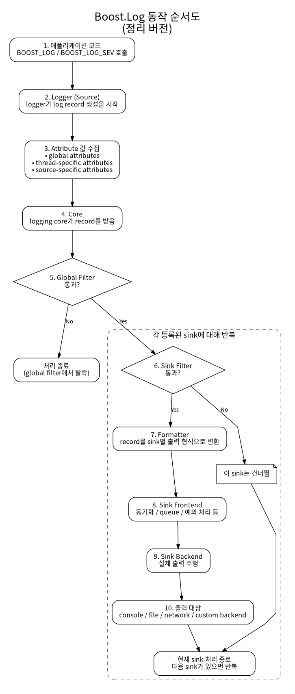

# Diagram

`Boost.Log`의 전체 흐름을 한 장으로 다시 보는 문서다.

## 이 그림에서 보면 좋은 점

- `logger`가 직접 파일이나 콘솔에 쓰는 것이 아니라 `core`를 거쳐 sink로 전달된다는 점
- global filter와 sink filter가 서로 다른 위치에 있다는 점
- sink 내부에서도 formatter, frontend, backend가 분리된다는 점

## 현재 예제와 연결되는 부분

- `Phase 01`: logger에서 record가 만들어지는 시작점
- `Phase 02`: attribute가 record에 붙고 formatter가 출력 문자열을 만드는 부분
- `Phase 03`: record가 console sink와 file sink로 fan-out 되는 부분
